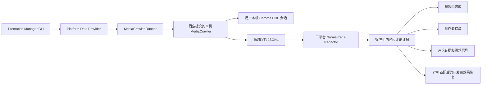

# MediaCrawler 本机 Sidecar 集成设计

**日期：** 2026-07-13

**状态：** 已批准，待实施计划

**目标项目：** `viral-product-copy-video-generator`

**首批平台：** 小红书、抖音、知乎

## 1. 背景与目标

当前 Promotion Manager 已能通过 Firecrawl、浏览器证据和人工证据完成部分公开网页采集，但小红书、抖音、知乎的内容详情、互动指标和评论证据仍存在明显缺口。MediaCrawler 已获得作者对当前商业产品使用、修改和部署的授权，因此本设计将它作为用户本机运行的独立采集 Sidecar 接入现有数据链路。

集成目标是：

- 使用用户本机 Chrome 中由用户亲自完成的登录态采集数据，Cookie 不上传、不写入项目、不进入命令行。
- 补齐三平台的关键词搜索、内容详情、创作者作品、一级评论、二级评论和页面可见指标。
- 将上游差异统一为稳定的 ENHE 数据契约，供现有爆款内容库、创作者榜单、评论证据和效果恢复流程消费。
- 当 Sidecar 未安装、平台阻断或需要人工验证时安全降级，不破坏当前 Promotion Manager 工作流。
- 以保守的单任务、低频率、低数量默认值运行，不实现验证码绕过、风控规避或多账号扩张。

## 2. 前提与边界

### 2.1 前提

- 商业授权覆盖当前付费产品中的使用、修改和部署。若实际授权范围更窄，上线范围必须同步收窄。
- 用户对所登录账号和所采集数据具有合法使用权限，并遵守平台规则、适用法律及个人信息保护要求。
- 登录、验证码、滑块和账号验证始终由用户在本机可见浏览器中手动完成。

### 2.2 V1 范围

- 平台：`xiaohongshu`、`douyin`、`zhihu`。
- 模式：关键词搜索、内容详情、创作者作品。
- 数据：内容正文、公开作者展示信息、发布时间、标签、页面可见互动指标、一级评论；二级评论能力存在但默认关闭。
- 入口：Promotion Manager CLI。
- 浏览器扩展：只生成可复制的 CLI 命令，不增加 localhost、Native Messaging、Cookie 或浏览器存储读取权限。

### 2.3 非目标

- 不下载图片、视频或音频媒体。
- 不提供代理池、账号池、多账号轮换或自动登录。
- 不自动处理验证码、滑块、扫码确认、短信验证或账号风控。
- 不把 MediaCrawler 代码直接导入主项目进程，不复制上游源码进主仓库。
- 不把 Cookie、授权头、签名参数、原始用户 ID 或原始抓取文件上传到 ENHE 服务、GitHub 或任何远端。
- 不用竞品数据冒充或补写本项目已发布内容的真实效果数据。

## 3. 方案选择

### 3.1 采用方案：隔离、固定版本的上游 checkout + 子进程适配器

MediaCrawler 安装在主仓库之外的用户目录，使用独立且兼容的 Python/`uv` 环境。Promotion Manager 通过受控子进程调用它，并通过 JSONL 文件交换数据。安装清单记录完整的 40 位上游提交哈希，运行时校验实际 checkout 与清单一致；不自动跟随上游 `main`。

该方案的优势是：

- 主项目与上游依赖、Python 版本和内部模块隔离。
- 上游结构变化不会直接破坏主进程导入。
- 可以独立审计输入、输出、日志和清理行为。
- 更新必须显式变更固定提交并通过回归测试，便于商业发布控制。

### 3.2 未采用方案

**Git submodule + Python 直接导入：** 依赖和内部 API 耦合过强，上游升级容易破坏主项目运行环境。

**复制上游源码到主仓库：** 容易形成长期分叉，增加授权标注、漏洞修复和升级维护成本。

## 4. 总体架构



### 4.1 组件职责

**Promotion Manager CLI**

- 接收平台、模式、查询词、内容 URL/ID、数量限制和输出目录。
- 提供只读检查、显式安装、采集、取消和状态展示入口。
- 不接收 Cookie、Token、授权头或签名参数。

**Platform Data Provider**

- 在现有 WebDataProvider 体系中注册可选的 `mediacrawler` provider。
- 只将小红书、抖音、知乎的受支持请求路由到 Sidecar。
- 保留当前 Firecrawl、浏览器证据和人工证据路径。
- 对所有返回记录保留 `provider` 和 `platform` 来源，禁止无来源合并。

**MediaCrawler Runner**

- 校验安装、固定提交、环境和单任务锁。
- 以参数白名单启动上游子进程，管理超时、取消、退出码和临时目录。
- 捕获上游输出，但在写日志和清单前先脱敏。
- 只清理由本次任务创建的进程和临时文件，不关闭用户已有 Chrome。

**三平台 Normalizer + Redactor**

- 将三平台上游字段映射为统一内容、评论和创作者记录。
- 在内存中将原始用户 ID 转为安装级加盐哈希，随后丢弃原始 ID。
- 清除 URL 中的 `xsec_token`、签名和其他认证参数。
- 生成稳定的标准化 JSONL、运行清单和下游适配输入。

### 4.2 本机目录与隔离

Sidecar 的 checkout、虚拟环境、安装清单、锁文件和本机脱敏盐位于仓库外的 ENHE 用户数据目录。主仓库只保存适配代码、离线测试夹具和文档。

每次任务的项目内输出位于：

```text
promotion-output/reports/promotion-manager/platform-data/mediacrawler/<run-id>/
```

目录结构：

```text
<run-id>/
├── run-manifest.json
├── contents.jsonl
├── comments.jsonl
├── creators.jsonl
└── raw/                  # 仅任务进行中存在；成功标准化后默认删除
```

整个 `platform-data/mediacrawler/` 运行输出必须被 Git 忽略。`evidencePath` 只能引用标准化文件及其行号，不得引用 `raw/`。

## 5. CLI 目标接口

V1 采用以下命令形态；实施时保持与现有 `promotion_manager.py` 参数风格一致：

```powershell
python scripts/promotion_manager.py platform-data setup --check
python scripts/promotion_manager.py platform-data setup --install
python scripts/promotion_manager.py platform-data collect --platform xiaohongshu --mode search --query "关键词"
python scripts/promotion_manager.py platform-data collect --platform douyin --mode detail --url "内容链接"
python scripts/promotion_manager.py platform-data collect --platform zhihu --mode creator --creator-url "创作者链接"
```

### 5.1 `setup --check`

- 完全只读，不克隆、不下载、不创建环境、不修改 Chrome。
- 检查受支持 Python/`uv`、本机 Chrome、Sidecar 目录、固定提交、依赖环境和写入权限。
- 输出各项状态和明确修复建议，不输出本机敏感路径之外的个人信息。

### 5.2 `setup --install`

- 是唯一允许执行网络安装的设置命令。
- 明确展示将要克隆的仓库、固定提交和本机目标目录。
- 创建隔离环境并校验完整提交哈希，不修改主项目依赖。
- 安装完成后自动执行与 `setup --check` 相同的校验。

### 5.3 `collect`

- 默认使用可见浏览器和用户明确连接的本机 Chrome CDP 会话。
- 未登录时返回 `waiting_login` 并提示用户在浏览器中登录后重试或继续。
- 浏览器扩展只负责生成同等命令文本，用户需自行复制到终端执行。
- `--keep-raw` 为显式调试开关；启用前必须显示原始数据可能包含敏感字段的警告，并在清单中记录。

## 6. 标准化数据契约

所有标准化记录使用 `schemaVersion: 1` 和 `provider: "mediacrawler"`。字段缺失时使用 `null` 或空数组，不伪造数值。

### 6.1 内容记录

| 字段 | 类型 | 规则 |
|---|---|---|
| `schemaVersion` | integer | 固定为 `1` |
| `provider` | string | 固定为 `mediacrawler` |
| `platform` | string | `xiaohongshu`、`douyin` 或 `zhihu` |
| `contentId` | string | 平台内容 ID；清除认证参数后保留 |
| `sourceUrl` | string | 规范化公开 URL，不含 Token、签名或跟踪参数 |
| `contentType` | string | 平台内容类型的规范化枚举 |
| `title` | string/null | 可见标题 |
| `text` | string/null | 可见正文或描述 |
| `authorHash` | string/null | 原始用户 ID 经安装级加盐哈希后的稳定值 |
| `authorDisplayName` | string/null | 脱敏展示名，不保留可识别账号号段 |
| `publishedAt` | string/null | ISO 8601；无法可靠解析时为 `null` |
| `sourceKeyword` | string/null | 本次搜索词；详情模式可为 `null` |
| `tags` | array[string] | 可见标签去重列表 |
| `metrics` | object | `views`、`likes`、`favorites`、`comments`、`shares`，缺失项为 `null` |
| `capturedAt` | string | UTC ISO 8601 采集时间 |
| `evidencePath` | string | 相对运行目录的标准化证据文件与行号 |

### 6.2 评论记录

| 字段 | 类型 | 规则 |
|---|---|---|
| `schemaVersion` | integer | 固定为 `1` |
| `provider` | string | 固定为 `mediacrawler` |
| `platform` | string | 规范化平台名 |
| `contentId` | string | 所属内容 ID |
| `commentId` | string | 平台评论 ID |
| `parentCommentId` | string/null | 一级评论为 `null`，回复指向父评论 |
| `text` | string | 可见评论文本 |
| `authorHash` | string/null | 安装级加盐哈希 |
| `authorDisplayName` | string/null | 脱敏展示名 |
| `createdAt` | string/null | ISO 8601 |
| `likes` | integer/null | 页面可见点赞数 |
| `replyCount` | integer/null | 页面可见回复数 |
| `sourceUrl` | string | 不含认证参数的公开内容 URL |
| `capturedAt` | string | UTC ISO 8601 采集时间 |
| `evidencePath` | string | 标准化证据文件与行号 |

### 6.3 创作者记录

创作者记录只保存下游榜单所需的最小公开信息：`platform`、`authorHash`、脱敏 `authorDisplayName`、规范化公开主页 URL、由本次内容集合聚合出的可见指标、内容数量、`capturedAt` 和 `evidencePath`。原始用户 ID 和主页认证参数不得持久化。

### 6.4 身份脱敏

- 首次安装生成本机随机盐，保存在仓库外的 ENHE 用户数据目录。
- `authorHash` 使用平台名、原始用户 ID 和本机盐生成；只保存截断后的不可逆哈希。
- 原始用户 ID 只允许在单条记录规范化期间驻留内存，完成哈希后立即丢弃。
- 若上游没有稳定用户 ID，则 `authorHash` 为 `null`，不得用展示名伪造稳定身份。

## 7. 数据流与下游规则

### 7.1 竞品研究

- 搜索和详情内容进入爆款内容库。
- 内容与创作者聚合记录进入创作者榜单。
- 可见互动指标用于竞品排序，并保留平台、采集时间和证据路径。
- 同一平台下优先以 `contentId` 去重；缺少 ID 时使用规范化 URL；跨平台不合并为同一内容。

### 7.2 评论与需求证据

- 一级和二级评论进入评论证据导出。
- `parentCommentId` 保留对话关系，便于需求信号和异议主题分析。
- 重复评论以 `platform + contentId + commentId` 去重。
- 评论文本可用于聚合分析，但任何对外报告必须继续遵守现有证据引用和隐私策略。

### 7.3 已发布内容效果恢复

竞品数据和本项目自有发布数据必须严格分离：

1. 只有 Promotion Manager 发布登记中已经存在的真实 `platform + contentId` 才能匹配自有内容。
2. 若发布登记暂时没有 `contentId`，只允许使用登记过的规范化公开 URL 精确匹配；不能用标题、作者名、关键词或相似文本匹配。
3. 匹配成功后，页面可见指标才能写入该发布记录的效果恢复结果。
4. 未匹配记录始终标记为竞品证据，绝不能计入自有表现、复盘或商业报表。

## 8. 运行清单

每次运行必须生成 `run-manifest.json`，至少包含：

- `schemaVersion`、`runId`、`provider`、`upstreamRepository`、完整 `upstreamCommit`。
- `platform`、`mode`、脱敏后的查询描述、请求数量限制和实际数量。
- 内容、评论、创作者的读取数、标准化数、丢弃数和重复数。
- `status`、开始/结束时间、耗时、超时和取消信息。
- 是否触发登录、人工验证、平台阻断、一次网络重试或安全降级。
- 脱敏规则版本、已移除敏感字段名称列表、原始目录是否清理。
- `keepRaw` 是否由用户显式启用。
- 下游写入结果及任何部分成功说明。

清单不得包含查询参数中的 Token、Cookie、授权头、签名值、原始用户 ID、完整原始响应或浏览器存储内容。

## 9. 安全默认值与资源控制

| 项目 | V1 默认值 |
|---|---|
| 同时运行的 Sidecar 任务 | 1 |
| 每次最大内容数 | 20 |
| 每个内容最大一级评论数 | 30 |
| 二级评论 | 支持但默认关闭 |
| 页面并发 | 1 |
| 页面间最小间隔 | 2 秒 |
| 单任务默认超时 | 15 分钟 |
| 网络瞬时失败重试 | 最多 1 次 |
| 代理池 | 关闭且 V1 不提供 |
| 媒体下载 | 关闭且 V1 不提供 |
| 多账号 | 关闭且 V1 不提供 |

用户可以把内容数和评论数调低；V1 不允许通过普通 CLI 参数突破上述硬上限。取消任务时应先终止本次 Sidecar 子进程，再清理由本次任务创建的临时文件和锁，不影响用户已有浏览器进程。

## 10. 状态、错误与降级

### 10.1 状态枚举

| 状态 | 含义 |
|---|---|
| `ready` | 请求数据全部完成并通过标准化 |
| `partial_ready` | 有可用标准化结果，但部分请求失败或降级 |
| `waiting_login` | 需要用户在本机浏览器登录 |
| `manual_verification_required` | 需要验证码、滑块、扫码或账号确认 |
| `blocked_by_platform` | 平台明确阻断或触发风控 |
| `no_results` | 请求成功但没有可见结果 |
| `provider_unavailable` | Sidecar 未安装、版本不匹配或环境不可用 |
| `normalization_error` | 上游返回存在但无法安全映射 |
| `cancelled` | 用户取消 |
| `error` | 未分类的运行错误 |

`run-manifest.json` 中的状态是下游判断的权威来源；人类可读终端提示必须与清单一致。

### 10.2 处理规则

- 遇到登录、验证码、滑块或账号验证时立即暂停并提示用户，不自动求解、不重复撞库。
- 网络瞬时错误最多重试一次；风控、人工验证和无结果不进入重试循环。
- 上游字段结构变化时停止写入受影响记录，状态为 `normalization_error` 或 `partial_ready`；诊断文件只保留脱敏字段名和脱敏样本。
- Sidecar 不可用时，现有 Firecrawl、浏览器证据或人工证据流程继续运行，整体结果可标记为 `partial_ready`。
- Sidecar 崩溃时释放本次任务锁并清理本次资源，不关闭用户 Chrome。
- 所有日志在落盘前移除 Cookie、Token、`xsec_token`、`Authorization`、签名参数和原始用户 ID。

## 11. 原始数据生命周期

1. 上游原始 JSONL 只写入本次运行的 `raw/` 临时目录。
2. Normalizer 流式读取、脱敏和写入标准化文件，避免在其他目录复制原始数据。
3. 所有标准化文件成功关闭并完成安全扫描后，默认删除 `raw/`。
4. 部分成功或失败时仍优先删除原始文件；仅保留脱敏诊断信息。
5. 只有用户显式使用 `--keep-raw` 才保留原始目录，并在终端和清单中记录安全警告。
6. 保留的原始目录同样被 Git 忽略，任何上传或发布命令都必须排除该目录。

## 12. 更新策略

- 上游完整提交哈希记录在单独的 Sidecar 安装清单中。
- 正常启动只校验，不执行 `git pull`、依赖升级或环境重建。
- 更新必须由显式维护命令触发，并先在隔离临时 checkout 中安装。
- 新提交只有在三平台离线夹具、适配器回归测试和人工冒烟测试全部通过后才能替换当前固定提交。
- 更新失败时保留上一版本并恢复原安装清单，不能留下半升级状态。
- 商业授权凭证本身不进入公开仓库；仓库只记录授权范围已由项目所有者确认。

## 13. 测试设计

### 13.1 自动化测试

新增独立测试文件，避免继续扩展现有大型 `scripts/test_promotion_manager.py`。测试完全离线，不访问真实平台、不启动真实 Chrome。

覆盖内容：

- 小红书、抖音、知乎的脱敏 JSONL 夹具。
- 三平台内容、评论、创作者和指标字段映射。
- 内容去重、评论去重、一级与二级评论关系。
- 自有发布记录的 `platform + contentId` 和规范化 URL 精确匹配。
- 竞品指标不能污染自有表现数据。
- `Cookie`、Token、`xsec_token`、`Authorization`、签名参数和原始用户 ID 脱敏。
- 默认清理原始目录及 `--keep-raw` 显式警告。
- 使用假 Sidecar 子进程验证超时、取消、非零退出、部分成功和锁释放。
- provider 缺失、版本不匹配和环境不可用时的现有流程降级。
- 清单计数、状态、固定提交和清理字段的一致性。

CI 只运行离线夹具和假子进程测试，不执行真实采集。

### 13.2 人工冒烟测试

在项目所有者控制的本机账号和 Chrome 会话中执行：

1. 运行 `setup --check`，确认它没有网络和写入副作用。
2. 用户在本机 Chrome 中分别登录小红书、抖音、知乎。
3. 每个平台执行一次关键词搜索，最大读取 3 条内容。
4. 每个平台执行一次内容详情采集。
5. 每个平台最多读取 5 条一级评论，并在一个平台显式开启二级评论。
6. 验证爆款内容库、创作者榜单、评论证据和严格匹配的效果恢复输入。
7. 扫描所有标准化输出、清单和日志，确认不存在 Cookie、Token、签名和原始用户 ID。
8. 任务完成、取消和失败后确认用户 Chrome 仍保持打开。
9. 停止或移除 Sidecar 后确认当前 Promotion Manager 仍能通过原有 provider 工作。

人工冒烟测试使用最小数据量，不作为持续自动化任务运行。

## 14. V1 验收标准

以下条件全部满足才视为 V1 完成：

- 小红书、抖音、知乎均至少真实完成一次搜索、详情和评论采集。
- 三平台结果均按 `schemaVersion: 1` 生成标准化内容、评论或创作者记录。
- 标准化结果能被现有爆款内容库、创作者榜单、评论证据链消费。
- 只有严格匹配已登记发布 URL/内容 ID 的数据可进入自有效果恢复。
- 所有自动化测试通过，人工冒烟测试记录完整。
- 项目目录、日志、标准化输出和 Git 暂存区均不存在 Cookie、Token、签名参数或原始用户 ID。
- Sidecar 未安装、登录待处理、人工验证、平台阻断、超时和取消均返回明确状态并安全降级。
- 原始数据默认清理，用户 Chrome 不被 Sidecar 关闭。
- 安装、登录、运行、排错和固定提交更新文档完整可执行。

## 15. 实施范围约束

后续实施计划必须保持以下原则：

- 先用离线测试定义规范化、脱敏、匹配和子进程行为，再编写实现。
- 只修改接入所需文件，不顺带重构 Promotion Manager 其他模块。
- 首次交付只覆盖三平台和已批准模式，不增加其他 MediaCrawler 平台。
- 先完成 CLI 和本机 Sidecar 闭环；扩展端只增加命令生成，不新增高权限通道。
- 每个实现阶段都以可运行测试、可检查清单或最小人工冒烟结果作为完成证据。
